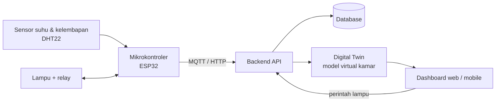
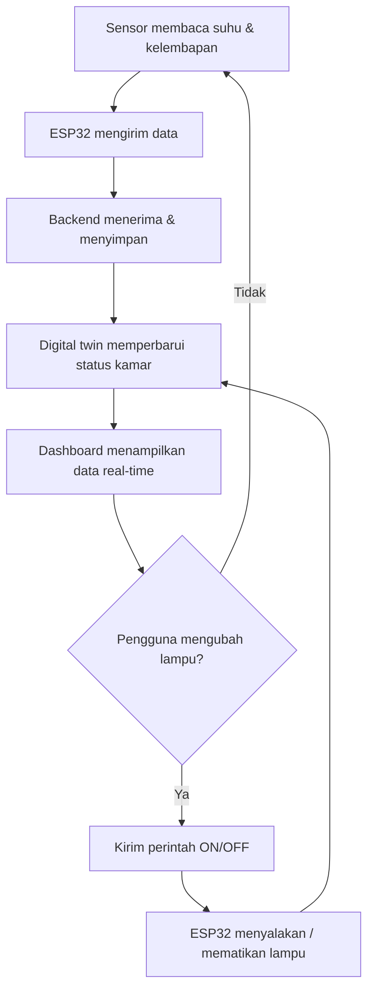
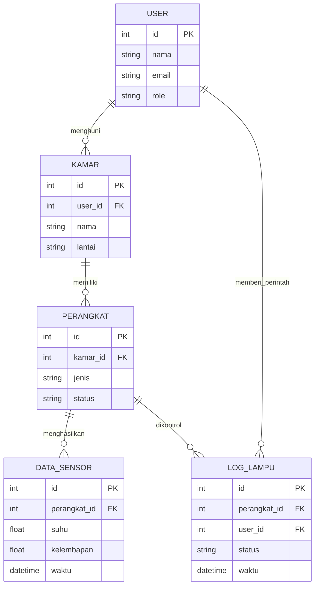

DIGITAL TWIN
============

Objek: kamar kos

Suhu       : 28°C

Kelembapan : 65%

Lampu      : MENYALA


Orang      : 1

Status Ruangan:
NORMAL

--------------------
Data diperbarui...
--------------------

DIGITAL TWIN SMART ROOM

[SENSOR]

Suhu       = 28°C

Kelembapan = 65%

[PERANGKAT]

Lampu = ON


[STATUS]

Ruangan Normal


```mermaid
## 2. Dokumen Desain & Arsitektur (Project Setup & UX Design)

### 2.1 Rancangan UX/UI

Tautan Figma: [Wireframe Digital Twin Kamar Kos](https://www.figma.com/GANTI-DENGAN-TAUTAN-KALIAN)

Daftar layar:

| No | Layar | Fungsi |
|----|-------|--------|
| 1 | Login | Masuk ke aplikasi |
| 2 | Dashboard Kamar | Menampilkan suhu, kelembapan, dan status lampu |
| 3 | Digital Twin | Visual kamar dengan indikator real-time |
| 4 | Kontrol Lampu | Tombol ON/OFF lampu |
| 5 | Grafik Riwayat | Grafik suhu dan kelembapan |
| 6 | Pengaturan | Perangkat dan notifikasi |

Sketsa wireframe layar Dashboard Kamar:

```text
+--------------------------------+
|  Kamar Kos A-01        [Menu]  |
+--------------------------------+
|  +-----------+  +-----------+  |
|  |  SUHU     |  | KELEMBAPAN|  |
|  |  28 C     |  |  65 %     |  |
|  +-----------+  +-----------+  |
|  +--------------------------+  |
|  |  LAMPU        [ ON | OFF ]|  |
|  +--------------------------+  |
|  +--------------------------+  |
|  |  Grafik 24 jam terakhir  |  |
|  +--------------------------+  |
+--------------------------------+
| Home | Twin | Riwayat | Atur   |
+--------------------------------+
```

### 2.2 Rancangan Sistem

#### Arsitektur Sistem



#### Flowchart Alur Data



#### ERD (Struktur Database)



