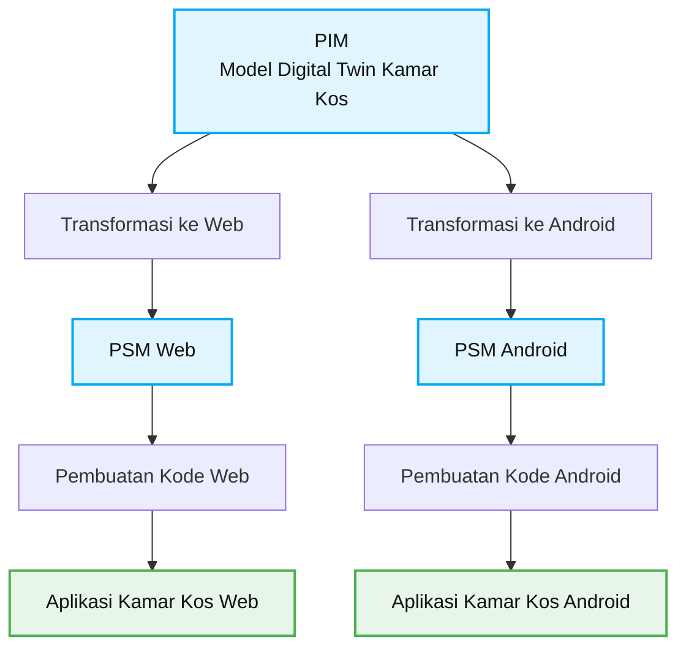
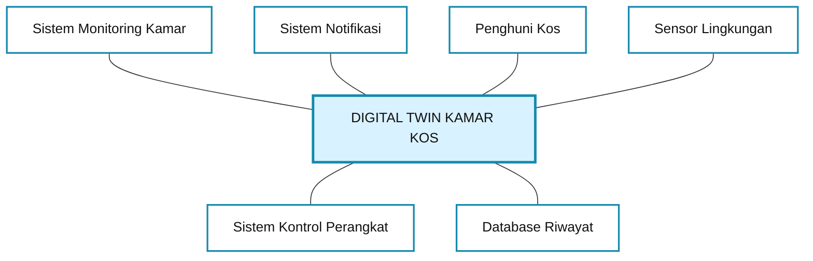
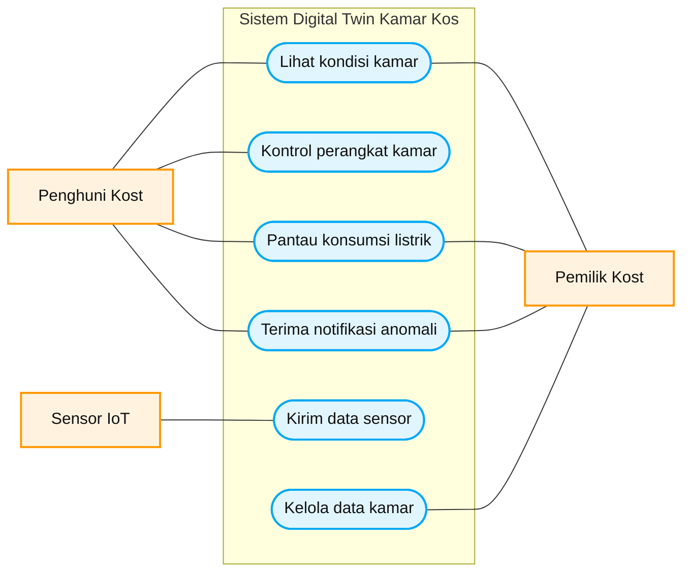
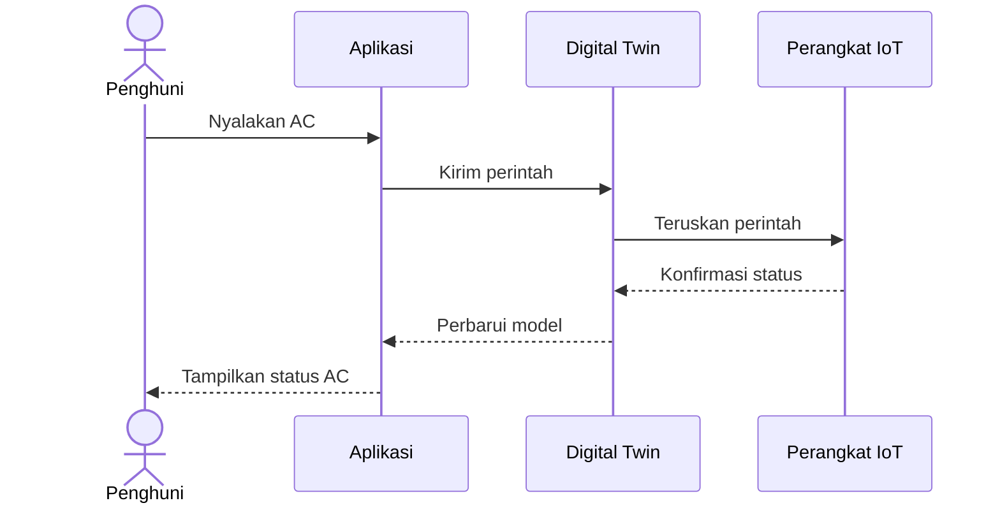
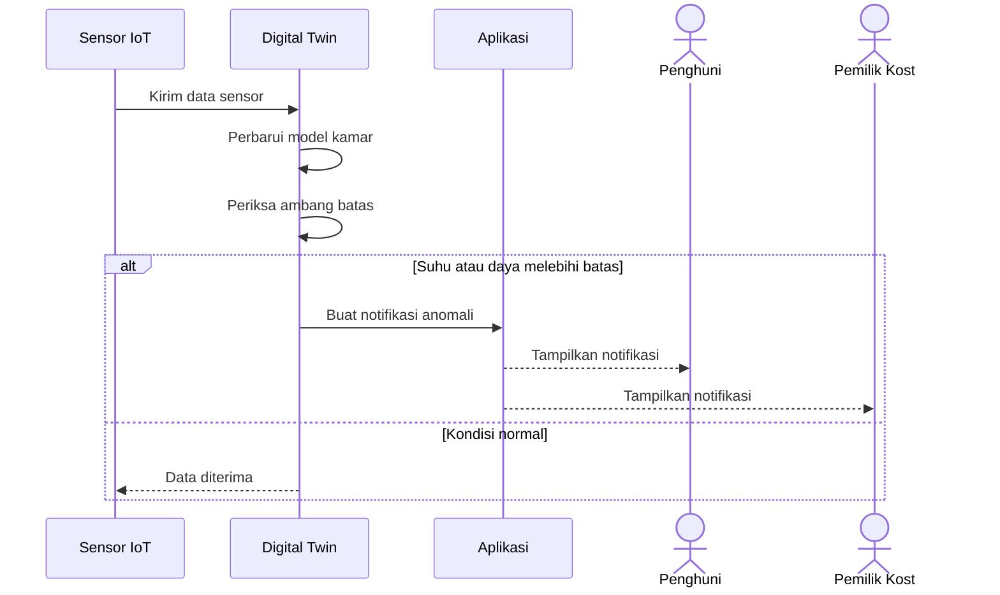

## 2. Alur MDA Sederhana

Diagram ini memperlihatkan bagaimana satu model sistem dapat
dikembangkan untuk beberapa platform.

Dengan pendekatan ini, rancangan sistem dapat dibuat terlebih dahulu
sebelum diimplementasikan menjadi aplikasi.

**Catatan:** Diagram ini merupakan ilustrasi proses MDA. Transformasi
model dan pembuatan kode otomatis memerlukan alat atau generator
yang sesuai; diagram saja tidak otomatis menghasilkan program.

## Context Model — DIGITAL TWIN KAMAR KOS

### Keterangan

1. **Sistem Monitoring Kamar:** menampilkan suhu dan kelembapan.
2. **Sistem Notifikasi:** memberikan pemberitahuan jika kondisi kamar tidak normal.
3. **Penghuni Kos:** memantau kondisi dan mengatur perangkat.
4. **Sensor Lingkungan:** mengirim data kondisi kamar.
5. **Sistem Kontrol Perangkat:** mengatur lampu dan perangkat lain.
6. **Database Riwayat:** menyimpan catatan kondisi kamar.

### Kesimpulan

Context Model ini menggambarkan hubungan Digital Twin Kamar Kos dengan enam sistem atau pihak yang mendukung pemantauan dan pengendalian kamar.

## 3. Use Case Diagram

Diagram ini menunjukkan interaksi antara aktor (penghuni kost, pemilik kost, dan sensor IoT)
dengan fungsi-fungsi utama pada sistem Digital Twin Kamar Kos.

## 4. Deskripsi Use Case

Detail interaksi dijabarkan dalam tabel. Berikut contoh untuk use case Kontrol perangkat kamar.

| Digital Twin Kamar Kos: Kontrol perangkat kamar | |
|---|---|
| Aktor | Penghuni kost, perangkat IoT (AC, lampu) |
| Deskripsi | Penghuni mengirim perintah dari aplikasi, misalnya menyalakan AC atau mematikan lampu. Perintah diproses oleh model digital twin, diteruskan ke perangkat fisik, lalu status terbaru ditampilkan kembali di aplikasi. |
| Data | Perintah kontrol, status perangkat, suhu dan kelembapan ruangan |
| Stimulus | Perintah yang diberikan penghuni melalui aplikasi |
| Respons | Konfirmasi bahwa perangkat sudah berubah dan model digital twin sudah diperbarui |
| Komentar | Penghuni harus login dan terdaftar sebagai penyewa kamar tersebut. Perangkat harus terhubung ke jaringan. |

## 5. Sequence Diagram

### 5.1 Kontrol perangkat kamar

Diagram ini menunjukkan urutan pesan saat penghuni menyalakan AC.
Garis putus-putus adalah pesan balasan.

### 5.2 Notifikasi anomali

Diagram ini menunjukkan alur saat sensor mengirim data dan sistem mendeteksi kondisi tidak wajar.

