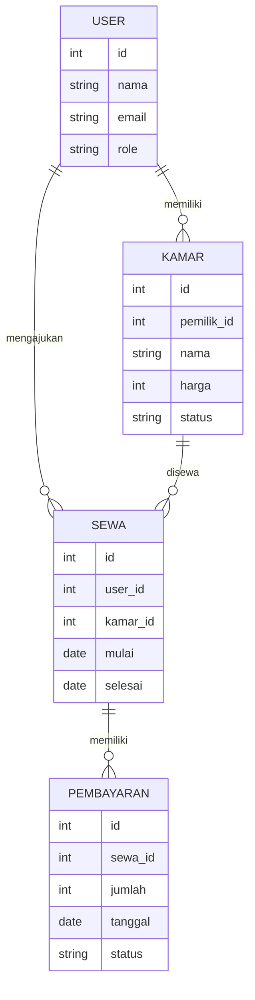

DIGITAL TWIN
============

Objek: kamar kos

Suhu       : 28°C
Kelembapan : 65%
Lampu      : MENYALA
AC         : MENYALA
Orang      : 25

Status Ruangan:
NORMAL

--------------------
Data diperbarui...
--------------------

DIGITAL TWIN SMART ROOM

[SENSOR]
Suhu       = 28°C
Kelembapan = 65%

[PERANGKAT]
Lampu = ON
AC    = ON

[STATUS]
Ruangan Normal

