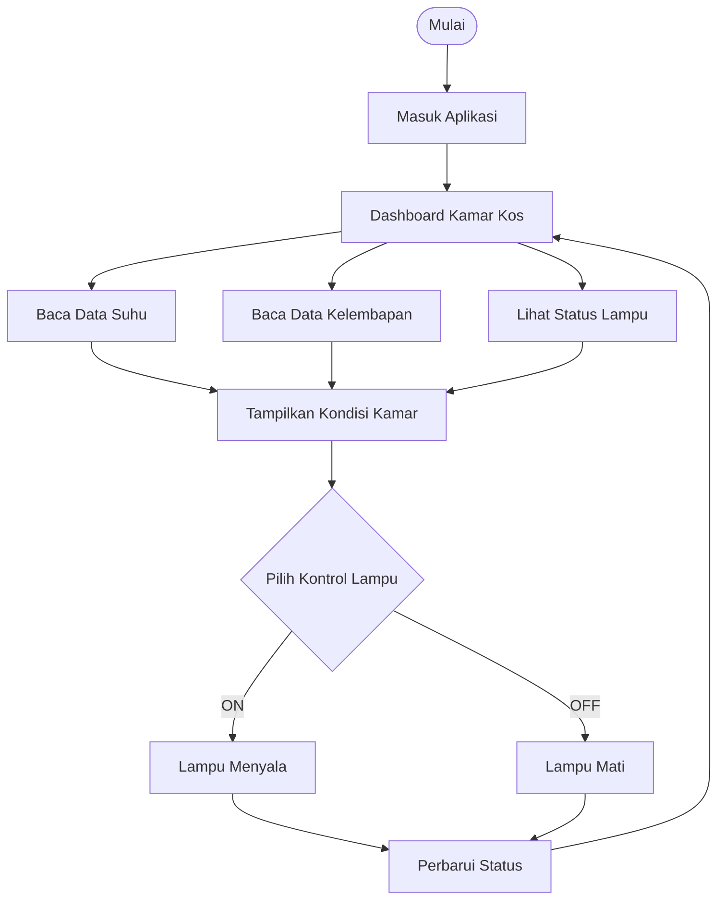
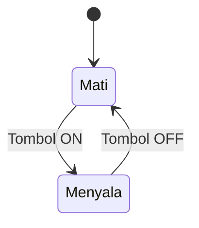

# 🏠 DIGITAL TWIN KAMAR KOS

Selamat datang di proyek Digital Twin Kamar Kos!
Sistem ini digunakan untuk memantau kondisi kamar secara digital.
> Maaf kami masih pemula, Bu. Mohon maaf jika masih banyak kesalahan.

## 🌡️ Contoh Data Kamar

| Informasi | Nilai |
|---|---|
| Suhu | 28°C |
| Kelembapan | 65% |
| Lampu | HIDUP |
| Status | Normal |

## 📊 Diagram Alur Sistem

## 💡 Diagram Status Lampu

