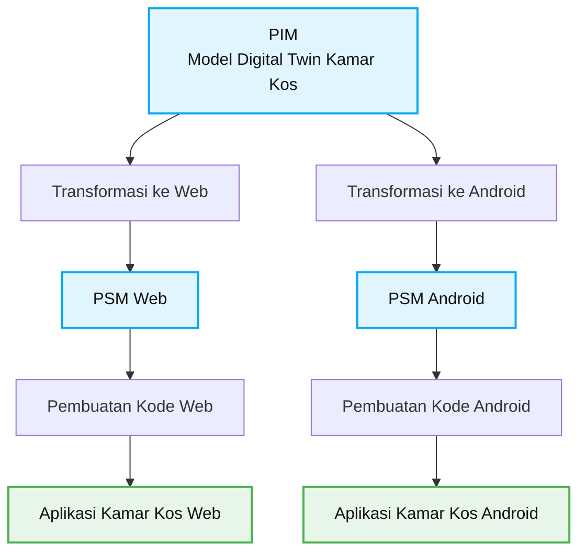
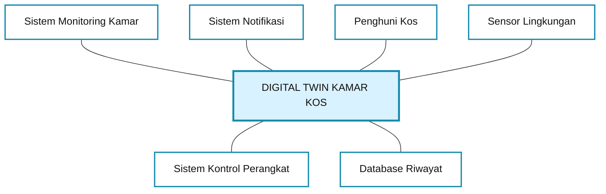

## 2. Alur MDA Sederhana

Diagram ini memperlihatkan bagaimana satu model sistem dapat
dikembangkan untuk beberapa platform.

Dengan pendekatan ini, rancangan sistem dapat dibuat terlebih dahulu
sebelum diimplementasikan menjadi aplikasi.

**Catatan:** Diagram ini merupakan ilustrasi proses MDA. Transformasi
model dan pembuatan kode otomatis memerlukan alat atau generator
yang sesuai; diagram saja tidak otomatis menghasilkan program.

## Context Model — DIGITAL TWIN KAMAR KOS

### Keterangan

1. **Sistem Monitoring Kamar:** menampilkan suhu dan kelembapan.
2. **Sistem Notifikasi:** memberikan pemberitahuan jika kondisi kamar tidak normal.
3. **Penghuni Kos:** memantau kondisi dan mengatur perangkat.
4. **Sensor Lingkungan:** mengirim data kondisi kamar.
5. **Sistem Kontrol Perangkat:** mengatur lampu dan perangkat lain.
6. **Database Riwayat:** menyimpan catatan kondisi kamar.

### Kesimpulan

Context Model ini menggambarkan hubungan Digital Twin Kamar Kos dengan enam sistem atau pihak yang mendukung pemantauan dan pengendalian kamar.
